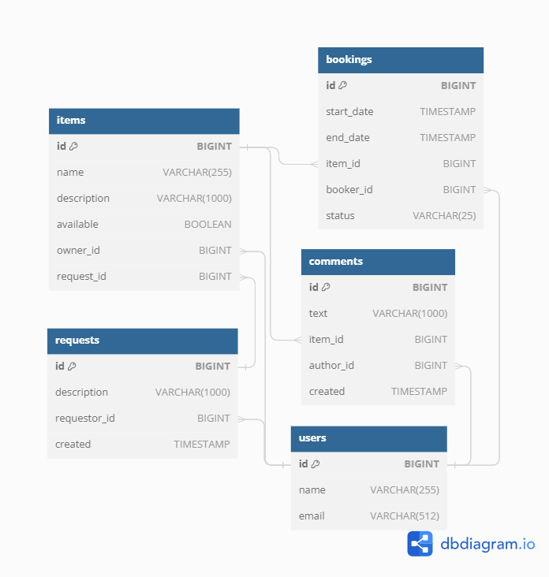

# Share it
Учебный проект, представляющий из себя приложение для обмена вещами среди друзей. Позволяет хранить в базе данных информацию о пользователях, вещях, которые они готовы предоставить на прокат, создавать запросы на бронирование (аренду), обрабатывать запросы (принимать или отклонять, т.д.), добавлять комментарии пользователей.

## Проект был реализован в течение 4 спринтов:
1. Реализация моделей item и user, хранения данных в оперативной памяти, DTO и маппер-классов, каркаса приложения и части вэб-слоя.  
Стэк: Java 11, Spring Boot, Maven, REST, Lombok, Postman.
2. Реализация моделей booking, comments, хранения в БД.  
Стек: JPA, Hibernate, PostgreSQL, H2(для тестов).
3. Реализация модели request, пагинации, тестов для сервисов, контроллеров, репозиториев, мапперов, json. Покрытие тестами 90%.  
Стек: Junit5, Mockito, Hamcrest.
4. Реализация микросервисной архитектуры. Добавление модуля  gateway - сюда перенесена вся логика валидации входных данных кроме той, которая требует работы с БД.  
Стек: микросервисы, Docker

[Тесты Postman](https://github.com/yandex-praktikum/java-shareit/blob/add-docker/postman/sprint.json)

### Иструкция по развертыванию
* mvn clean package
* mvn install
* docker-compose build
* docker-compose up -d
* gateway: http://localhost:8080
* основной сервис: http://localhost:9090

### Схема базы данных

